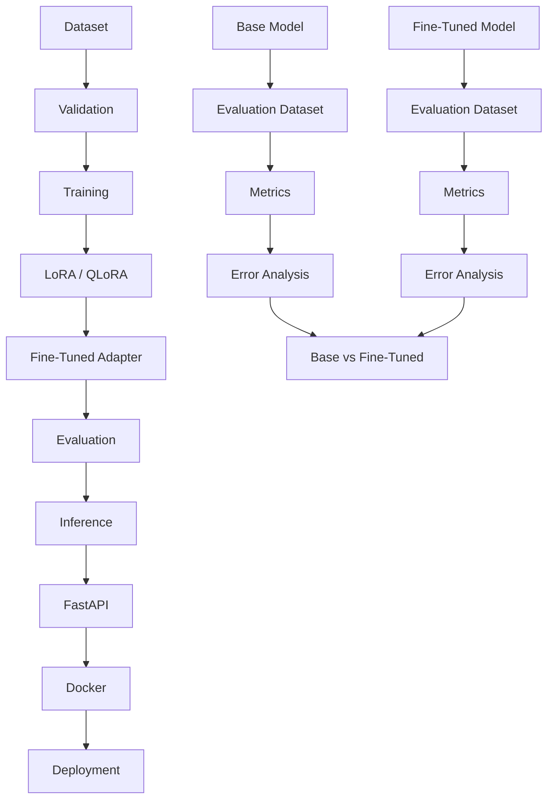

# SQL SLM Fine-Tuning Project

## Problem

This project is a practical, interview-ready implementation focused on building a domain-specific small language model for SQL and data engineering assistance. The goal is not to pretend that a large production training run occurred; the goal is to build a reproducible baseline and fine-tuning pipeline with evaluation, safety checks, and an inference API.

## Why Fine-Tuning?

Fine-tuning is useful when a model needs to follow a narrower domain contract: schema-aware SQL generation, query explanation, SQL correction, and safe read-only SQL behavior. A general-purpose model may be able to write SQL, but it often still needs domain grounding, validation, and constrained output behavior.

This project compares:

- base model behavior
- fine-tuned adapter behavior
- safety and correctness checks
- real implementation boundaries

## Architecture



## Model

Selected model: Qwen2.5-3B-Instruct

Reason for selection:

- small enough to be realistically fine-tuned with QLoRA on modest GPU resources
- active community support and common tooling compatibility
- good instruction following for structured text tasks
- manageable memory footprint when quantized
- feasible for local experimentation and interview demonstration

This is a realistic choice for an SLM project. It is not claimed to be the single best SQL model in the world.

## Dataset

The project uses a synthetic dataset designed for:

- basic SQL generation
- intermediate SQL generation
- advanced SQL generation
- SQL explanation
- SQL correction
- SQL optimization

Each record follows this schema:

```json
{
  "instruction": "Generate a SQL query to answer the question.",
  "input": "List customers with revenue above 5000.",
  "schema": "customers(id, name, city, revenue)",
  "output": "SELECT ..."
}
```

Training data is stored under [data](data/README.md) and is intentionally synthetic, with validation rules for duplicates, malformed rows, empty outputs, and invalid SQL syntax.

## Training

The repository is structured around a realistic LoRA fine-tuning setup using the Hugging Face ecosystem.

Key training decisions:

- LoRA instead of full fine-tuning
- QLoRA-friendly model selection
- small task-specific dataset
- controlled output format
- validation set for loss tracking
- explicit safety checks around SQL output

A training script is implemented under [src/training/train.py](src/training/train.py). It validates the JSONL train/validation splits, tokenizes the SQL completion while masking prompt tokens from the loss, applies LoRA or 4-bit QLoRA, evaluates on the validation split, and saves the adapter and tokenizer. CPU-only tests cover formatting, masking, padding, ROCm backend detection, dry-run behavior, and the unsupported CPU/4-bit guard.

### AMD / ROCm training

Install a ROCm-enabled PyTorch build matched to your AMD GPU, operating system, and installed ROCm release using [AMD's current PyTorch instructions](https://rocm.docs.amd.com/projects/install-on-linux/en/latest/install/3rd-party/pytorch-install.html) or the supported Windows ROCm package source for your specific release. Then activate the environment and install this project's dependencies. For QLoRA, also verify that the installed bitsandbytes wheel supports your exact ROCm/GPU combination; see the [bitsandbytes AMD installation matrix](https://huggingface.co/docs/bitsandbytes/en/installation#amd-rocm).

Before training, verify the runtime reports a HIP build and an available accelerator:

```powershell
python -c "import torch; print('HIP:', torch.version.hip); print('GPU available:', torch.cuda.is_available()); print('GPU count:', torch.cuda.device_count())"
python -m src.training.train --config configs/training.yaml --dry-run
```

The dry-run validates data/configuration but downloads no model and writes no adapter. The initial AMD Cloud smoke run used one MI300X VF with a ROCm-enabled PyTorch container, one epoch, and two optimizer steps. It completed and saved an adapter, but the dataset contains only 19 training and 4 validation examples; this verifies pipeline execution, not useful production fine-tuning.

In the AMD ROCm PyTorch container, run:

```bash
cd /shared-docker/sql-slm-finetuning
python3 -m src.training.train --config configs/training.yaml --dry-run
python3 -m src.training.train --config configs/training.yaml
python3 -m src.evaluation.model_evaluation --test-file data/test.jsonl --adapter-dir artifacts/checkpoints --model Qwen/Qwen2.5-3B-Instruct
```

The completed run reported train loss `1.4969` and validation loss `1.7522`. On the 5-row held-out split, base and adapter exact match were both `0/5`; on the four SQL targets, both produced a syntactically valid and safety-filter-passing first code block (`4/4`). The adapter did not improve exact match. Full predictions include trailing prompt-like continuation, so these preliminary metrics must not be presented as production quality. See [PROJECT_EVIDENCE.md](PROJECT_EVIDENCE.md).

A separate schema-conditioned experiment used 1,000 filtered rows from the CC-BY-4.0 SQL-Create-Context dataset (800 train / 100 validation / 100 test). After one epoch and 50 optimizer steps, train loss was `0.3254` and validation loss was `0.0874`. On the 100-row held-out split, the adapter scored `61/100` normalized exact match, `100/100` parse-valid SQL, and `100/100` safety-pass; the base scored `0/100`, `27/100`, and `100/100`, respectively. This is a promising result on a random split from the same derived dataset, not an independent benchmark or execution-accuracy claim. See [PROJECT_EVIDENCE.md](PROJECT_EVIDENCE.md) for provenance and limitations.

## Evaluation

Evaluation is intentionally multi-layered:

- syntax validity
- safety checks
- execution validity when applicable
- semantic correctness
- invalid SQL rate
- unsafe SQL rate
- latency

The evaluation logic is implemented in [src/evaluation/evaluate.py](src/evaluation/evaluate.py) and [src/evaluation/metrics.py](src/evaluation/metrics.py).

## Base vs Fine-Tuned Results

The project intentionally distinguishes measured evidence from proposals.

- Initial 5-row synthetic smoke split: base and adapter exact match were both 0/5; parse/safety checks passed on 4/4 SQL targets
- 100-row SQL-Create-Context-derived split: base 0/100 vs adapter 61/100 normalized exact match; parse validity 27/100 vs 100/100; safety pass 100/100 for both
- Transfer check on the original 5-row synthetic split after the larger fine-tune: adapter exact match remained 0/5; syntax/safety passed on 4/4 SQL targets
- Independent BIRD Mini-Dev SQLite subset (30 rows across 3 databases): execution accuracy 4/30 for both base and adapter; parse validity 16/30 vs 25/30; exact match 1/30 vs 0/30
- Schema guard offline audit rejected 12/26 adapter execution failures while accepting all four execution-correct outputs; a six-row prompt/guard check stayed at 2/6 execution accuracy, with no retry triggered
- Reliable semantic/database accuracy: NOT DEMONSTRATED
- Test coverage for software behavior: VERIFIED
- Dataset validation: VERIFIED
- API validation: VERIFIED

No fake numbers are included.

## Error Analysis

Examples of expected failure categories are captured in the project design and evaluation logic:

- syntax valid but semantic mismatch
- hallucinated columns and tables
- unsafe SQL generation
- schema misunderstanding
- prompt mismatch
- overfitting or poor generalization

The error-analysis scaffolding is in [src/evaluation/error_analysis.py](src/evaluation/error_analysis.py).

## Inference

The inference layer is separated from the API in [src/inference/generate.py](src/inference/generate.py). It validates input, runs generated SQL through the safety checks, and uses the deterministic template only when no model adapter is configured.

To run the API with a saved LoRA adapter, set `SQL_MODEL_ADAPTER_DIR` to the adapter directory before starting Uvicorn. The model and adapter are loaded once when the API starts:

```bash
SQL_MODEL_ADAPTER_DIR=./artifacts/checkpoints \
SQL_MODEL_USE_4BIT=true \
python -m uvicorn api.main:app --host 0.0.0.0 --port 8000
```

`SQL_MODEL_NAME` overrides `MODEL_NAME`; `SQL_MODEL_MAX_NEW_TOKENS` defaults to 128. The model-backed mode requires a compatible PyTorch CUDA/ROCm runtime for 4-bit loading. Without an adapter path, the API stays in template mode and does not load model weights.

## API

The API is implemented with FastAPI in [api/main.py](api/main.py).

Endpoints:

- GET /health
- POST /generate

`POST /generate` accepts a natural-language `prompt` and an optional database `schema`. For adapter-backed inference, both values are passed through the same instruction format used during training; the returned SQL is validated before it is sent back.

```json
{
  "prompt": "List customer names in Boston",
  "schema": "customers(id, name, city)"
}
```

## Demo UI

The Streamlit client in [frontend/streamlit_app.py](frontend/streamlit_app.py) submits a question and schema to the API and displays the generated SQL. Install its separate dependencies with `pip install -r frontend/requirements.txt`, then run `streamlit run frontend/streamlit_app.py`. Set `SQL_API_URL` if the API is not available at `http://127.0.0.1:8000`.

For a private AMD demo, keep the API on a container-only port and forward it over SSH to local port 8000. Do not publish the model API directly to the internet without adding authentication and abuse controls.

## Safety

The project includes safety validation for:

- DROP, ALTER, DELETE, UPDATE, INSERT statements
- destructive SQL blocks
- malformed requests
- long input detection
- output validation
- failure-safe behavior

This is a bounded SQL assistant, not a direct SQL executor.

## Testing

Automated tests cover:

- dataset validation
- missing fields
- duplicates
- malformed examples
- API behavior
- inference behavior
- SQL safety

See [tests](tests).

## Docker

A Dockerfile and docker-compose file are included for reproducible local deployment.

## Deployment

The API supports adapter-backed local inference when configured as above. A public hosted deployment is not currently provided; exposing the endpoint would require authentication, rate limiting, and operational monitoring.

## Limitations

- The initial AMD MI300X smoke run used one epoch/two optimizer steps on 19 synthetic training rows; it validates the pipeline, not model quality.
- A separate one-epoch run on 800 filtered SQL-Create-Context examples improved held-out exact match on its 100-row random split; this is not an independent benchmark and may benefit from source/schema overlap.
- The adapter did not transfer exact-match performance to the original five synthetic test rows (0/5); the same-source benchmark gain should not be generalized.
- Execution-based evaluation covered only 30 BIRD Mini-Dev examples; both models were correct on 4/30, so reliable execution accuracy is not demonstrated.
- Schema-grounding validation catches some nonexistent identifiers, but the six-row prompt/guard check did not improve execution accuracy; no retry was triggered.
- The public dataset is derived from WikiSQL and Spider, not enterprise production data.
- The project is intentionally conservative about model performance claims.
- Real cloud deployment would require GPU inference and operational monitoring.

## Future Improvements

- expand execution-based evaluation on an independently sourced SQL benchmark
- investigate why syntax-valid generations do not execute correctly
- add a stronger evaluation harness
- expand and validate a representative SQL training/evaluation corpus
- improve prompt/stop-sequence behavior and run multi-epoch experiments with held-out semantic and execution evaluation
- add model registry and MLOps artifacts

## Interview Questions

- What is LoRA and why is it useful?
- Why not full fine-tuning?
- How did you validate the dataset?
- Why do you separate model inference from API logic?
- Why does execution accuracy matter more than BLEU or ROUGE for SQL?
- What happens when an unsafe SQL statement is generated?
- How would you scale this into production?

## Project Status

Status summary:

- Dataset pipeline: VERIFIED
- Initial AMD MI300X QLoRA smoke run: COMPLETED
- Schema-conditioned 800-row AMD QLoRA experiment: COMPLETED; preliminary held-out gain observed on one source-derived split
- API and tests: VERIFIED
- Independent benchmark, execution accuracy, and representative enterprise-data evaluation: NOT RUN
- Deployment: PROPOSED

## Evidence

See [PROJECT_EVIDENCE.md](PROJECT_EVIDENCE.md) for the real verification record and status labels.
