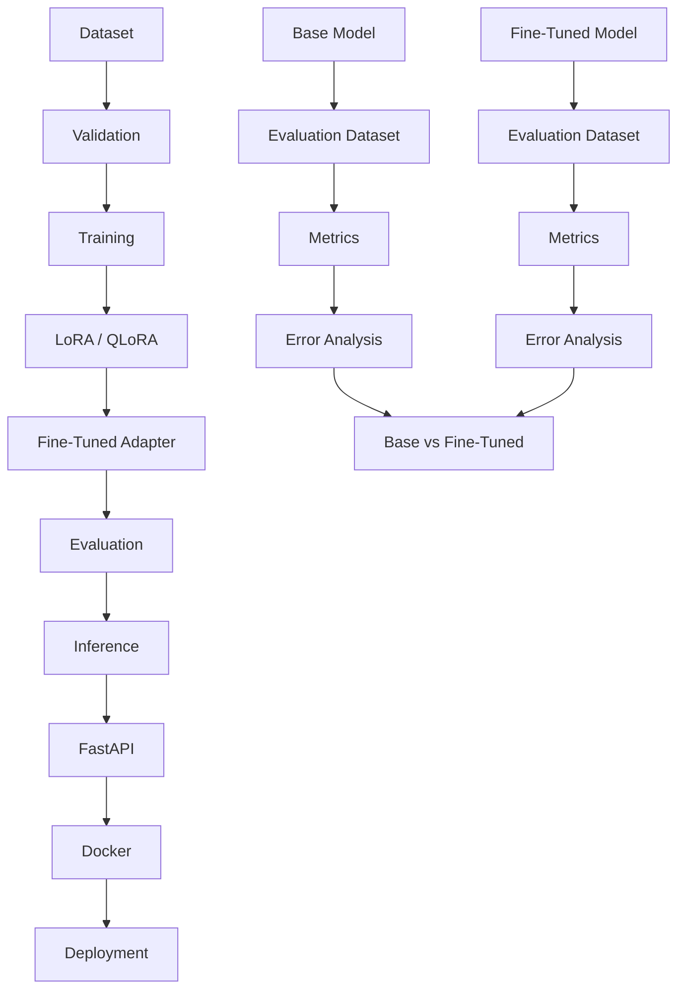

# SQL SLM Fine-Tuning Project

## Problem

This project is a practical, interview-ready implementation focused on building a domain-specific small language model for SQL and data engineering assistance. The goal is not to pretend that a large production training run occurred; the goal is to build a reproducible baseline and fine-tuning pipeline with evaluation, safety checks, and an inference API.

## Why Fine-Tuning?

Fine-tuning is useful when a model needs to follow a narrower domain contract: schema-aware SQL generation, query explanation, SQL correction, and safe read-only SQL behavior. A general-purpose model may be able to write SQL, but it often still needs domain grounding, validation, and constrained output behavior.

This project compares:

- base model behavior
- fine-tuned adapter behavior
- safety and correctness checks
- real implementation boundaries

## Architecture



## Model

Selected model: Qwen2.5-3B-Instruct

Reason for selection:

- small enough to be realistically fine-tuned with QLoRA on modest GPU resources
- active community support and common tooling compatibility
- good instruction following for structured text tasks
- manageable memory footprint when quantized
- feasible for local experimentation and interview demonstration

This is a realistic choice for an SLM project. It is not claimed to be the single best SQL model in the world.

## Dataset

The project uses a synthetic dataset designed for:

- basic SQL generation
- intermediate SQL generation
- advanced SQL generation
- SQL explanation
- SQL correction
- SQL optimization

Each record follows this schema:

```json
{
  "instruction": "Generate a SQL query to answer the question.",
  "input": "List customers with revenue above 5000.",
  "schema": "customers(id, name, city, revenue)",
  "output": "SELECT ..."
}
```

Training data is stored under [data](data/README.md) and is intentionally synthetic, with validation rules for duplicates, malformed rows, empty outputs, and invalid SQL syntax.

## Training

The repository is structured around a realistic LoRA fine-tuning setup using the Hugging Face ecosystem.

Key training decisions:

- LoRA instead of full fine-tuning
- QLoRA-friendly model selection
- small task-specific dataset
- controlled output format
- validation set for loss tracking
- explicit safety checks around SQL output

A training script is implemented under [src/training/train.py](src/training/train.py). It validates the JSONL train/validation splits, tokenizes the SQL completion while masking prompt tokens from the loss, applies LoRA or 4-bit QLoRA, evaluates on the validation split, and saves the adapter and tokenizer. CPU-only tests cover formatting, masking, padding, ROCm backend detection, dry-run behavior, and the unsupported CPU/4-bit guard.

### AMD / ROCm training

Install a ROCm-enabled PyTorch build matched to your AMD GPU, operating system, and installed ROCm release using [AMD's current PyTorch instructions](https://rocm.docs.amd.com/projects/install-on-linux/en/latest/install/3rd-party/pytorch-install.html) or the supported Windows ROCm package source for your specific release. Then activate the environment and install this project's dependencies. For QLoRA, also verify that the installed bitsandbytes wheel supports your exact ROCm/GPU combination; see the [bitsandbytes AMD installation matrix](https://huggingface.co/docs/bitsandbytes/en/installation#amd-rocm).

Before training, verify the runtime reports a HIP build and an available accelerator:

```powershell
python -c "import torch; print('HIP:', torch.version.hip); print('GPU available:', torch.cuda.is_available()); print('GPU count:', torch.cuda.device_count())"
python -m src.training.train --config configs/training.yaml --dry-run
```

The dry-run validates data/configuration but downloads no model and writes no adapter. The initial AMD Cloud smoke run used one MI300X VF with a ROCm-enabled PyTorch container, one epoch, and two optimizer steps. It completed and saved an adapter, but the dataset contains only 19 training and 4 validation examples; this verifies pipeline execution, not useful production fine-tuning.

In the AMD ROCm PyTorch container, run:

```bash
cd /shared-docker/sql-slm-finetuning
python3 -m src.training.train --config configs/training.yaml --dry-run
python3 -m src.training.train --config configs/training.yaml
python3 -m src.evaluation.model_evaluation --test-file data/test.jsonl --adapter-dir artifacts/checkpoints --model Qwen/Qwen2.5-3B-Instruct
```

The completed run reported train loss `1.4969` and validation loss `1.7522`. On the 5-row held-out split, base and adapter exact match were both `0/5`; on the four SQL targets, both produced a syntactically valid and safety-filter-passing first code block (`4/4`). The adapter did not improve exact match. Full predictions include trailing prompt-like continuation, so these preliminary metrics must not be presented as production quality. See [PROJECT_EVIDENCE.md](PROJECT_EVIDENCE.md).

## Evaluation

Evaluation is intentionally multi-layered:

- syntax validity
- safety checks
- execution validity when applicable
- semantic correctness
- invalid SQL rate
- unsafe SQL rate
- latency

The evaluation logic is implemented in [src/evaluation/evaluate.py](src/evaluation/evaluate.py) and [src/evaluation/metrics.py](src/evaluation/metrics.py).

## Base vs Fine-Tuned Results

The project intentionally distinguishes measured evidence from proposals.

- Base vs adapter exact match: 0/5 each on the tiny held-out split
- SQL parse/safety pass: 4/4 each for the first fenced SQL block; semantic/execution correctness not measured
- Test coverage for software behavior: VERIFIED
- Dataset validation: VERIFIED
- API validation: VERIFIED

No fake numbers are included.

## Error Analysis

Examples of expected failure categories are captured in the project design and evaluation logic:

- syntax valid but semantic mismatch
- hallucinated columns and tables
- unsafe SQL generation
- schema misunderstanding
- prompt mismatch
- overfitting or poor generalization

The error-analysis scaffolding is in [src/evaluation/error_analysis.py](src/evaluation/error_analysis.py).

## Inference

The inference layer is separated from the API in [src/inference/generate.py](src/inference/generate.py). It validates input, selects a model or fallback generator, and returns SQL output with a safety-check phase.

## API

The API is implemented with FastAPI in [api/main.py](api/main.py).

Endpoints:

- GET /health
- POST /generate

## Safety

The project includes safety validation for:

- DROP, ALTER, DELETE, UPDATE, INSERT statements
- destructive SQL blocks
- malformed requests
- long input detection
- output validation
- failure-safe behavior

This is a bounded SQL assistant, not a direct SQL executor.

## Testing

Automated tests cover:

- dataset validation
- missing fields
- duplicates
- malformed examples
- API behavior
- inference behavior
- SQL safety

See [tests](tests).

## Docker

A Dockerfile and docker-compose file are included for reproducible local deployment.

## Deployment

The current project is set up as a local reproducible inference/API project. Deployment beyond local Docker is marked as proposed rather than claimed production status.

## Limitations

- The AMD MI300X run was only one epoch/two optimizer steps on 19 synthetic training rows; it is a smoke run, not a meaningful quality result.
- Base and adapter exact match were both 0/5; the adapter did not show an accuracy gain.
- No execution-based or business-semantic evaluation has been run.
- Synthetic dataset is not enterprise production data.
- The project is intentionally conservative about model performance claims.
- Real cloud deployment would require GPU inference and operational monitoring.

## Future Improvements

- add larger SQL benchmark datasets
- add execution-based evaluation against SQLite or Postgres
- add a stronger evaluation harness
- expand and validate a representative SQL training/evaluation corpus
- improve prompt/stop-sequence behavior and run multi-epoch experiments with held-out semantic and execution evaluation
- add model registry and MLOps artifacts

## Interview Questions

- What is LoRA and why is it useful?
- Why not full fine-tuning?
- How did you validate the dataset?
- Why do you separate model inference from API logic?
- Why does execution accuracy matter more than BLEU or ROUGE for SQL?
- What happens when an unsafe SQL statement is generated?
- How would you scale this into production?

## Project Status

Status summary:

- Dataset pipeline: VERIFIED
- AMD MI300X QLoRA smoke run: COMPLETED; quality improvement NOT demonstrated
- API and tests: VERIFIED
- Large/representative GPU fine-tune: NOT RUN
- Deployment: PROPOSED

## Evidence

See [PROJECT_EVIDENCE.md](PROJECT_EVIDENCE.md) for the real verification record and status labels.
